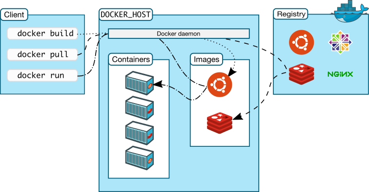

# Podman

## Images & Containers

> **Containerization** is an approach to software development in which an application or service, its dependencies, and its configuration (abstracted as deployment manifest files) are packaged together as a container image.

Just as shipping containers allow goods to be transported by ship, train, or truck regardless of the cargo inside, software containers act as a standard unit of software deployment that can contain different code and dependencies. Containerizing software this way enables developers and IT professionals to deploy them across environments with little or no modification.

Containers also isolate applications from each other on a shared OS. Containerized applications run on top of a container host that in turn runs on the OS. Containers therefore have a much smaller footprint than virtual machine (VM) images.

In short, containers offer the benefits of isolation, portability, agility, scalability, and control across the entire application lifecycle workflow.

## Containers vs Virtual Machines

A container runs *natively* on Linux and shares the kernel of the host machine with other containers. It runs a discrete process, taking no more memory
than any other executable, making it lightweight.

By contrast, a **virtual machine** (VM) runs a full-blown "guest" operating system with *virtual* access to host resources through a hypervisor. In general,
VMs incur a lot of overhead beyond what is being consumed by your application logic.


## [Podman Terminology](https://docs.docker.com/glossary/)



**Container image**: A package with all the dependencies and information needed to create a container. An image includes all the dependencies (such as frameworks) plus deployment and execution configuration to be used by a container runtime. Usually, an image derives from multiple base images that are layers stacked on top of each other to form the container’s filesystem. An image is immutable once it has been created.

**Containerfile**: A text file that contains instructions for building a Podman image. It’s like a batch script, the first line states the base image to begin with and then follow the instructions to install required programs, copy files, and so on, until you get the working environment you need.

**Build**: The action of building a container image based on the information and context provided by its Containerfile, plus additional files in the folder where the image is built. You can build images with the following Podman command: `podman build`

**Container**: An instance of a Podman image. A container represents the execution of a single application, process, or service. It consists of the contents of a Podman image, an execution environment, and a standard set of instructions. When scaling a service, you create multiple instances of a container from the same image. Or a batch job can create multiple containers from the same image, passing different parameters to each instance.

**Volumes**: Offer a writable filesystem that the container can use. Since images are read-only but most programs need to write to the filesystem, volumes add a writable layer, on top of the container image, so the programs have access to a writable filesystem. The program doesn’t know it’s accessing a layered filesystem, it’s just the filesystem as usual. Volumes live in the host system and are managed by Podman.

**Tag**: A mark or label you can apply to images so that different images or versions of the same image (depending on the version number or the target environment) can be identified.

**Multi-stage Build**: Is a feature, since Podman 17.05 or higher, that helps to reduce the size of the final images. For example, a large base image, containing the SDK can be used for compiling and publishing and then a small runtime-only base image can be used to host the application.

**Repository (repo)**: A collection of related Podman images, labeled with a tag that indicates the image version. Some repos contain multiple variants of a specific image, such as an image containing SDKs (heavier), an image containing only runtimes (lighter), etc. Those variants can be marked with tags. A single repo can contain platform variants, such as a Linux image and a Windows image.

**Registry**: A service that provides access to repositories. The default registry for most public images is [Podman Hub](https://hub.docker.com/) (owned by Podman as an organization). A registry usually contains repositories from multiple teams. Companies often have private registries to store and manage images they’ve created.

**Multi-arch image**: For multi-architecture, it’s a feature that simplifies the selection of the appropriate image, according to the platform where Podman is running.

**Podman Compose**: A command-line tool and YAML file format with metadata for defining and running multi-container applications. You define a single application based on multiple images with one or more `.yml` files that can override values depending on the environment. After you’ve created the definitions, you can deploy the whole multi-container application with a single command (podman compose up) that creates a container per image on the Podman host.

---

## [Podman CLI](https://docs.podman.io/en/latest/Commands.html)

### [`podman run`](https://docs.podman.io/en/latest/markdown/podman-run.1.html)

```sh
podman run <image>  # run selected app inside a container (downloaded from OCI registry if missing from image)
podman run -d|--detach <image>  # run podman container in the background (does not occupy stdout & stderr)
podman run -i|--interactive <image>  # run podman container in interactive mode (read stdin)
podman run -t|--tty <image>  # run podman container allocating a pseudo-TTY (show prompts)
podman run -p|--publish <host_port>:<container_port> <image>  # map container ports
podman run -v|--volume <existing_host_dir>:<container_dir> <image>  # map container directory to a host directory (external volumes)
podman run -v|--volume <volume_name>:<container_dir> <image>  # map container directory to a host directory under the podman main folder (external volumes)
podman run -e|--env NAME=value <image>  # set container env vars
podman run --entrypoint <executable> <args> <image>  # run with a non-default entrypoint
podman run --name=<container_name> <image>  # set container name
```

> **Warn**: `<image>` must be last argument

### [`podman container`](https://docs.podman.io/en/latest/markdown/podman-container.1.html)

```sh
podman container list  # list of currently running containers
podman container list -a|--all  # list of all containers, running and exited
podman container rm <container>  # remove one or more containers
podman container prune  # remove stopped containers

podman container inspect <container>  # full details about a container
podman container logs <container>  # see container logs

podman container stop <container>  # stop a running container
podman container start <container>  # start a stopped container

podman container exec <container> <command>  # exec a command inside a container
```

### [`podman image`](https://docs.podman.io/en/latest/markdown/podman-image.1.html)

```sh
podman image list  # list of existing images
podman image rm <image>  # remove one or more images
podman image prune <image>  # remove unused images
podman image pull <image>  # download an image w/o starting the container
```

### [`podman build`](https://docs.podman.io/en/latest/markdown/podman-build.1.html)

```sh
podman build --tag <tag> --file <containerfile> <context>  # build image with specific tag (usually user/app:version)
podman build --tag <tag> --file <containerfile> --build-arg ARG=value <context>  # pass args to ARG steps
podman build --tag <tag> --file <containerfile> --secret id=<id>,env=<ENV-VAR> <context>  # mount secret as /run/secrets/<id> and $ENV-VAR
```

### [`podman push`](https://docs.podman.io/en/latest/markdown/podman-push.1.html)

```sh
# Push to a container registry
podman push <registry>/<image>/<tag>

# Push to a container registry via the docker transport
podman push docker://<registry>/<image>/<tag>

# Push to a container registry with another tag
podman push <tag> <registry>/<image>
```

## [Containerfile](https://docs.docker.com/engine/reference/builder/)

```containerfile
# starting image or scratch
FROM <base_image>:<tag>

# run commands (e.g: install dependencies)
RUN <command>

# define working directory (usually /app)
WORKDIR <path>

# copy source code into the image in a specified location
COPY <src> <dir_in_container>

# accept args from podman run (--build-arg arg_name=value)
ARG <arg_name>

# set env values inside the container
ENV <ENV_VAR> <value>

# Exec form (Preferred form)
CMD ["<executable>", "<arg1>", "<arg2>"]
ENTRYPOINT ["<executable>", "<arg1>", "<arg2>"]

# Shell form
CMD <executable> <arg1> <arg2>
ENTRYPOINT <executable> <arg1> <arg2>
```

### `CMD` vs `ENTRYPOINT`

`CMD` is used to provide all the default scenarios which can be overridden. *Anything* defined in CMD can be overridden by passing arguments in `podman run` command.

`ENTRYPOINT` is used to define a specific executable (and it's arguments) to be executed during container invocation which cannot be overridden.  
The user can however define arguments to be passed in the executable by adding them in the `podman run` command.

### [Multi-Stage Build](https://docs.docker.com/develop/develop-images/multistage-build/)

With multi-stage builds, it's possible to use multiple `FROM` statements in the Containerfile. Each `FROM` instruction can use a different base, and each of them begins a new stage of the build.

It's possible to selectively copy artifacts from one stage to another, leaving behind everything not wanted in the final image.

```containerfile
FROM <base_image>:<tag> AS <runtime_alias>
RUN <command>  # install external dependencies (apt get ...)

# --- START of BUILD LAYERS --- #
FROM <base_image>:<tag> AS <build_alias>
WORKDIR <app_path>
  
# install project dependencies
COPY <src> <dir_in_container>  # add lockfiles
RUN <command>  # install project dependencies from lockfiles
  
COPY <src> .<dir_in_container>  # bring in all source code
WORKDIR <build_location>
ARG version
RUN <command>  # build project
# --- END of BUILD LAYERS --- #

FROM <runtime_alias> AS <deploy_alias>
WORKDIR <app_path>

# bring in release build files
COPY --from=<build_alias|stage_number> <src> <dir_in_container>
CMD ["executable"]  # run app
```

```containerfile
FROM mcr.microsoft.com/dotnet/<runtime|aspnet>:<alpine_tag> AS runtime
RUN <command>  # install external dependencies (apt get ...)

# --- START of BUILD LAYERS --- #
FROM mcr.microsoft.com/dotnet/sdk:<tag> as build
WORKDIR /app

# install project dependencies
COPY *.sln ./src
COPY src/*.csproj ./src
RUN dotnet restore

# publish app
COPY /src ./src  # bring in all source code
WORKDIR /app/src  # reposition to build location
ARG version
RUN dotnet publish <project>|<solution> -c Release -o out /p:Version=$version
# --- END of BUILD LAYERS --- #

FROM runtime AS final-runtime
WORKDIR /app
COPY --from=build /app/out .

ENTRYPOINT ["dotnet", "<project>.dll"]
```

---

## [Networking](https://docs.docker.com/engine/reference/commandline/network/)

Starting container networks: `bridge` (default), `none`, `host`.

```sh
podman run <image> --network=none/host  # specify a non-default network to be used
podman run <image> --add-host=<hostname>:<ip>  # add hostname mapping
podman network list  # list all available networks
```

- **Bridge**: Private internal network created by Podman.
  All containers ara attached to this network by default and get an IP in the `172.17.xxx.xxx-172.12.xxx.xxx` series.  
  Containers can access each other by using the IP `172.17.0.1`.  
  It is possible to create multiple sub-networks in the bridge network to isolate groups of containers from each other.
- **Host**: Removes any network isolation between the host and the containers. Cannot run multiple containers on the same port.
- **None**: Containers are not attached to a network and cannot access other containers or the external network.

> **Note**: Mapping `host-gateway` to an hostname allows the container to reach the host network even with networks types different from `host`

### User-defined Networks

```sh
podman network create --driver NETWORK_TYPE --subnet GATEWAY_TP/SUBNET_MASK_SIZE NETWORK_NAME
```

### Embedded DNS

Podman has an internal DNS that allows finding other container by their name instead of their IP. The DNS always runs at the address `127.0.0.11`.

### Exposing Ports

By default, containers on bridge networks don't expose any ports to the outside world. Using the `--publish` or `-p` flag makes a port available to services outside the bridge network. This creates a firewall rule in the host, mapping a container port to a port on the Podman host to the outside world.

Here are some examples:

| Flag value | Description |
|------------|-------------|
| `-p 8080:80` | Map port `8080` on the host to **TCP** port `80` in the container. |
| `-p 192.168.1.100:8080:80` | Map port `8080` on the host IP `192.168.1.100` to **TCP** port `80` in the container. |
| `-p 8080:80/udp` | Map port `8080` on the host to **UDP** port `80` in the container. |
| `-p 8080:80/tcp -p 8080:80/udp` | Map **TCP** and **UDP** port `8080` on the host to TCP and UDP port `80` in the container. |

> **Warn**: Publishing container ports is *insecure by default*. A published port it becomes available not only to the host, but to the outside world as well.  
> If the localhost IP address (`127.0.0.1`, or `::1`) is included with the publish flag, only the host and its containers can access the published container port.
>
> ```sh
> podman run --publish 127.0.0.1:8080:80 --publish '[::1]:8080:80' nginx
> ```

---

## Podman Storage

### File System

```sh
/var/lib/podman
|_<storage_driver>
|_containers
|_image
|_network
|_volumes
| |_specific_volume
|_...
```

### Copy-On-Write

To modify a file while the container is running podman creates a local copy in the specific container and the local copy will be modified.

### Volumes

**volume mounting**: create a volume under the podman installation folder (`/var/lib/podman/volumes/`).
**bind mounting**: link podman to an exiting folder to be used as a volume.

```sh
podman run -v <existing_dir>:<container_dir> <image>:<tag>  # older command for bind mounting
podman run --mount type=bind, source=:<existing_dir>, target=<container_dir> <image>:<tag>  # modern command for bind mounting
```

---

## Podman Compose

Compose is a tool for defining and running multi-container Podman applications. With Compose, you use a YAML file to configure your application’s services. Then, with a single command, you create and start all the services from your configuration.

Using Compose is basically a three-step process:

1. Define the app’s environment with a `Containerfile` so it can be reproduced anywhere.
2. Define the services that make up your app in `compose.yml` so they can be run together in an isolated environment.
3. Run `podman compose up` and compose starts and runs the entire app.

```yaml
services:
  <service_name>:
    image: <image_name>
    image: <image_url>
    build: <path>  # path to folder containing a Containerfile to build the image
    build:
      context: <path>
      containerfile: <*.Containerfile>
      args:  # pass args to containerfile
        ARG: <value>
        - ARG=<value>
    ports: 
      - <host_port>:<container_port>
    extra_hosts:  # add hostname mappings to container network interface config
      - <hostname>:<ip>
      - <hostname>:host-gateway  # map host machine network
    profiles:  # partition services into sets
      - <profile_name>
    networks:  # attach container to one or more networks
      - <network_name>
    depends_on:  # make sure dependencies are running before this container
      - <container_name>
    environment:  # declare a env vars for this service
      ENV_VAR: <value>
      - ENV_VAR=<value>
    env_file:
      - <path/to/env/file>  # reusable env file
    volumes:
      - "./<rel/path/to/volume>:<in/container/path/to/data>"  # service-dedicated volume
      - "<volume_name>:<in/container/path/to/data>"  # reuseable volume
    healthcheck:
      disable: <bool>  # set to true to disable
      test: curl -f http://localhost  # set to ["NONE"] to disable
      interval:  # interval between checks (default 30s)
      timeout:  # check fail timeout (default 30s)
      retries:  # num of retries before unhealty (default 3)
      start_period:  # container init grace pediod (default 5s)
      start_interval:  # check interval in start period

# reusable volume definitions
volumes:
  - <volume_name>:

# create networks
networks:
  <network_name>:
```
